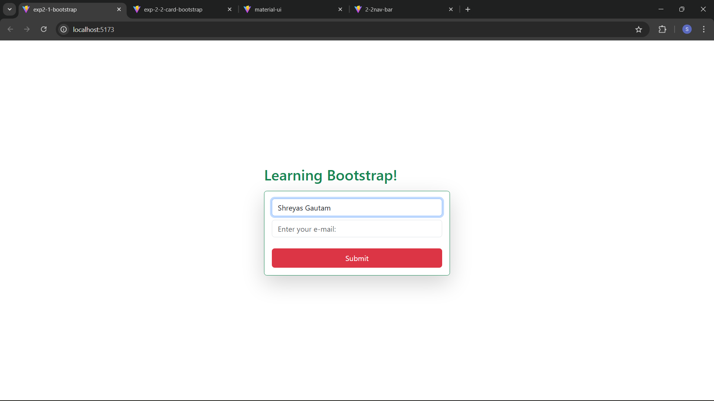

This project is a React-based web application focused on implementing Bootstrap 5 for layout and styling. The primary feature is a responsive, centered contact form that utilizes Bootstrap's utility classes and React's state management for interactive styling.

Features
Centralized Layout: Uses position-absolute and translate-middle utilities to perfectly center the UI on the screen.

Interactive UI: A custom-styled button that changes colors based on user interaction (Red by default, Blue on hover, and Green on click).

Responsive Design: Implements a card-based container with a defined maximum width to ensure a proper fit across different screen sizes.

Bootstrap Integration: Leverages the full Bootstrap 5 CSS framework for standardized input fields and buttons.

Tech Stack
Framework: React

Styling: Bootstrap 5

Build Tool: Vite

Getting Started
1. Installation
First, ensure you have all dependencies installed. From the project root, run:

npm install
Note: This command generates the node_modules folder required for the project to run.

2. Running the Development Server
To launch the application locally, use:

npm run dev
This will start the Vite development server.

File Structure
App.jsx: Contains the main structure and the React logic for dynamic class swapping.

App.css: (Optional) Used for custom style overrides that fall outside of standard Bootstrap utilities.

index.css: Handles global styles such as the body background or default typography.

## Screenshot
