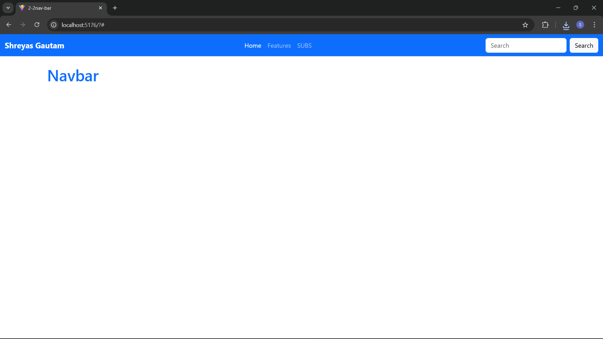

# Experiment 2.4: Bootstrap Navbar Customization

This experiment focuses on the implementation and customization of the **Bootstrap 5 Navbar** component within a React application.

## Features
* **Dynamic Layout:** Uses the `navbar-expand-lg` class to provide a desktop-friendly horizontal bar that collapses into a "hamburger" menu on mobile devices.
* **Alignment Control:** Demonstrates the use of Flexbox margin utilities (`me-auto`, `ms-auto`, `mx-auto`) to position navigation links.
* **Color Themes:** Implements Bootstrap's semantic color classes and custom inline styles for branding.
* **Dropdown Support:** Includes a functional dropdown menu for grouped navigation items.

## Tech Stack
* **React**
* **Bootstrap 5**
* **Vite**

## Usage
1. Run `npm install` to set up dependencies.
2. Run `npm run dev` to view the customized navbar in your browser.

## Screenshot
