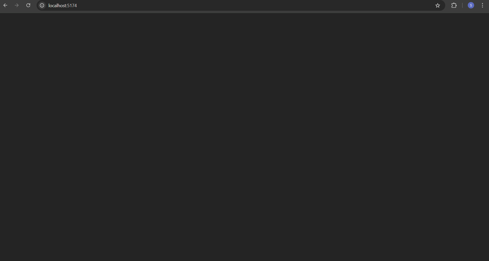
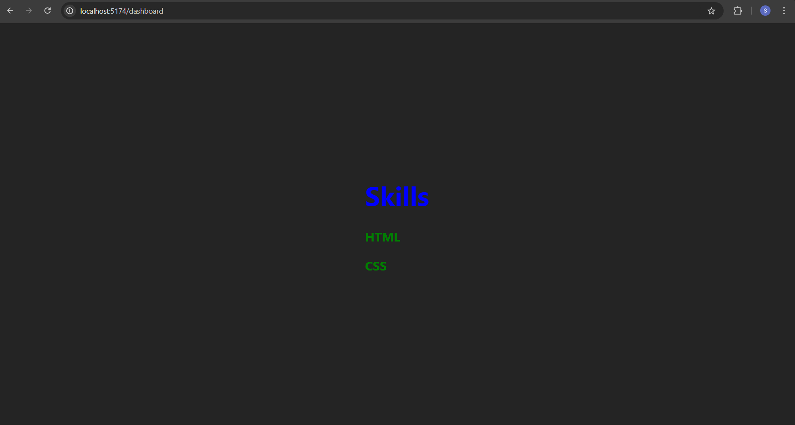
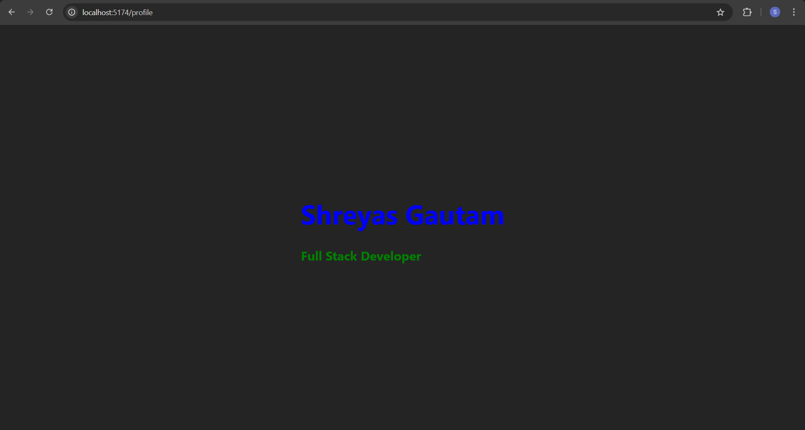

React Router Portfolio Experiment
This project demonstrates the use of react-router-dom to create a simple portfolio structure. It maps specific URL paths to developer information and skill sets, enabling a Single Page Application (SPA) experience.

## Project Overview
The application features two main views—Profile and Dashboard—managed by a declarative routing system that updates the UI based on the browser's URL.

### Key Components Used
BrowserRouter: The parent component that manages the routing history using clean URLs.
Routes: A container that matches the current URL path to the appropriate route.
Route: Defines the connection between a URL path and the specific React component to be rendered.

## Getting Started
1. Prerequisites
Ensure you have Node.js installed. In an existing React project, install the router library:

npm install react-router-dom
2. Styling (App.css)
To ensure all content is perfectly centered on the screen, use the following CSS:
html, body {
  margin: 0;
  padding: 0;
  height: 100vh;
}
#root {
  display: grid;
  place-items: center;
  height: 100vh;
  text-align: center;
}

3. Implementation
Replace the contents of your App.js with the provided code. The structure follows this logic:

Path|Component Rendered|Description|
/Profile|<Profile />|Displays name and job title.
/Dashboard|<Dashboard />|Displays developer skills (HTML, CSS).

## How to Run
Start the development server: npm start.
Open your browser to http://localhost:3000/Profile to see the profile view. (you may use any local server)
Change the URL to http://localhost:3000/Dashboard to view the skills list.

## Screenshots

