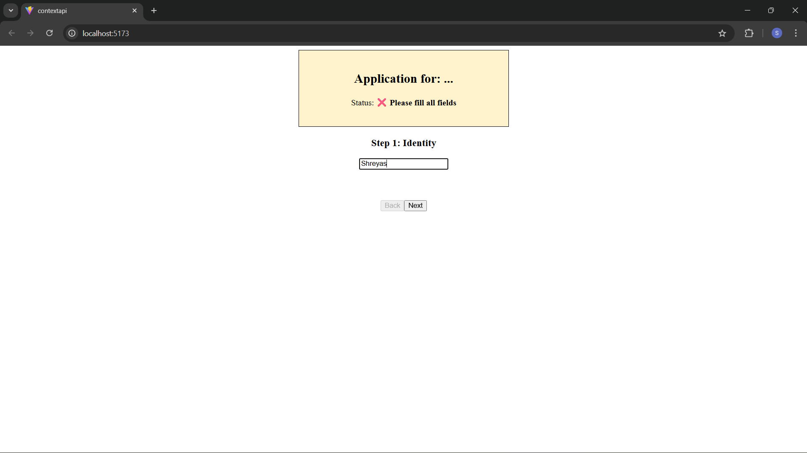
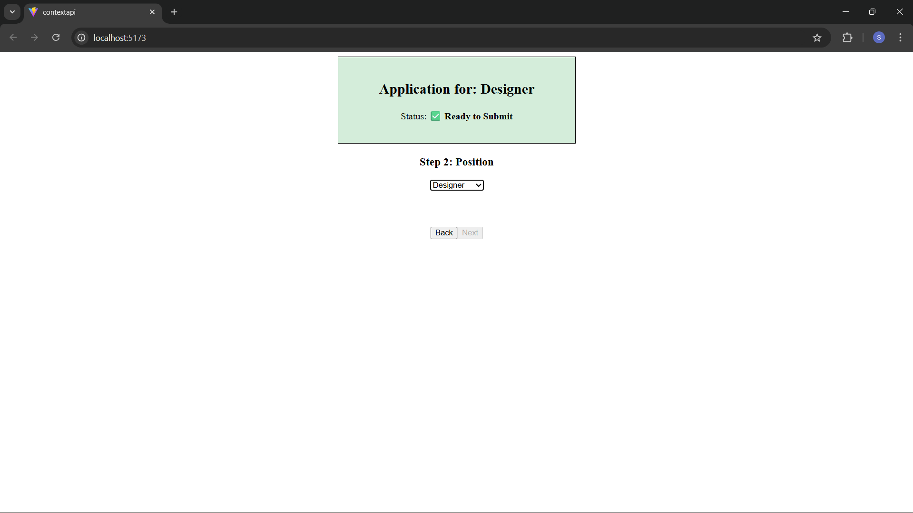
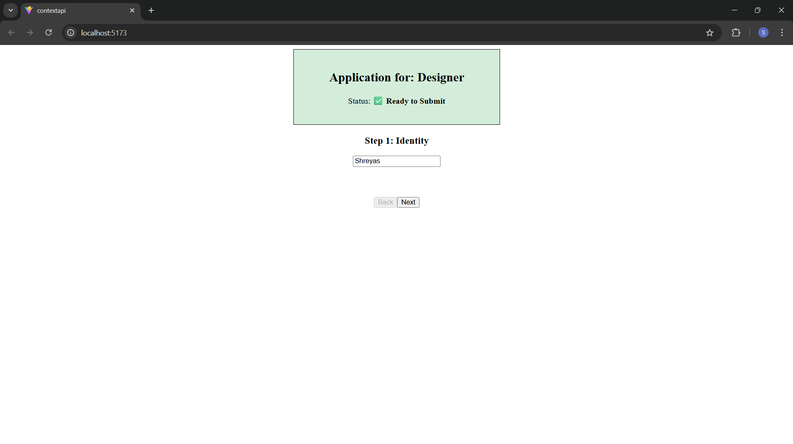

This README provides a comprehensive overview of the Multi-Step Form Wizard, a project designed to demonstrate the efficacy of the React Context API for global state management in a Single Page Application (SPA).

🚀 Multi-Step Form Wizard (Context API Demo)
This application serves as a conceptual framework for managing data across different UI views without "prop drilling." It features a persistent data layer that allows users to navigate between form steps while maintaining state and calculating progress globally.

📂 Project Structure
The project is organized to separate business logic (State) from UI components (View).

Plaintext
src/
├── context/
│   └── FormContext.jsx      # The "Radio Tower" (Global State & Logic)
├── components/
│   ├── Step1.jsx            # Identity Input View
│   ├── Step2.jsx            # Role Selection View
│   └── ProgressHeader.jsx   # Global Status Observer
├── App.jsx                  # Main Layout & Navigation Logic
└── main.jsx                 # Application Entry & Provider Injection
🛠️ Implementation Details
1. The Central Truth (FormContext.jsx)
Instead of local state, we use createContext() to establish a global "cloud" of data.

State Management: Holds a formData object containing user inputs.

Derived State: Automatically calculates isComplete based on the current state of all fields.

Value Provider: Exports formData, updateField, and isComplete to the entire component tree.

2. The Global Observer (ProgressHeader.jsx)
A header component that stays mounted regardless of which form step is visible. It listens to the Context and provides immediate feedback on form validity.

3. Step-Based Persistence (Step1.jsx & Step2.jsx)
These components demonstrate the primary advantage of Context:

Decoupling: They do not receive props from their parent.

Persistence: When a user switches steps (causing a component to unmount), the data remains safely stored in the FormProvider.

🚀 Getting Started
Prerequisites
Node.js installed on your machine.

A React project initialized via Vite.

Installation & Execution
Clone/Create the files following the folder structure above.

Start the development server:

npm run dev
Verify the logic:

Enter data in Step 1.

Navigate to Step 2.

Return to Step 1 and observe that the data is persisted without being passed through the parent App.jsx.

# Key Learning Objectives
Eliminating Prop Drilling: Avoiding passing data through "middleman" components that don't need it.

Global Reactivity: Understanding how multiple distant components can react to a single state change.

Separation of Concerns: Keeping the "How to update data" logic inside the Context file and the "How to show data" logic in the components.

# Screenshots
   