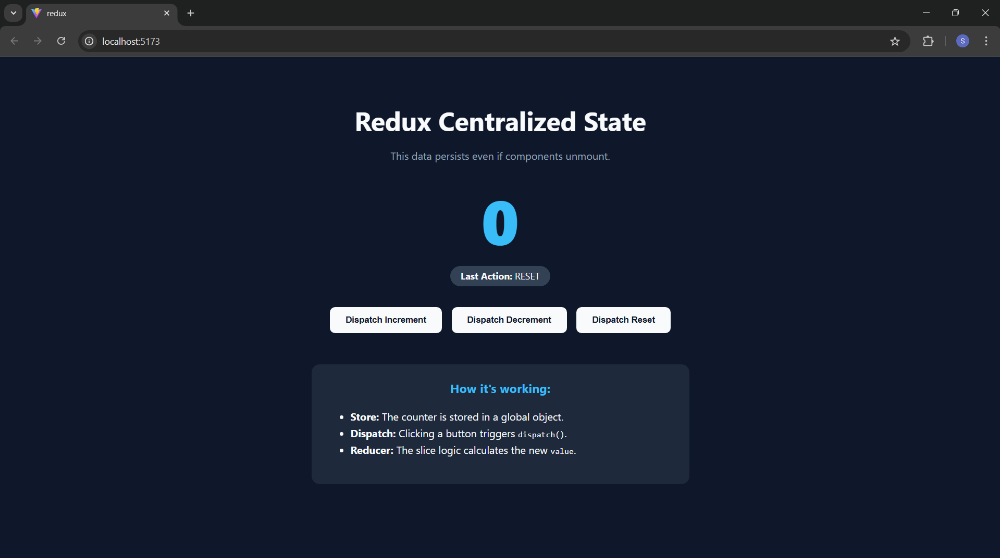
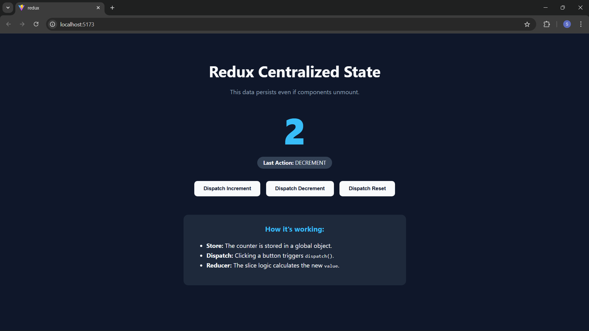
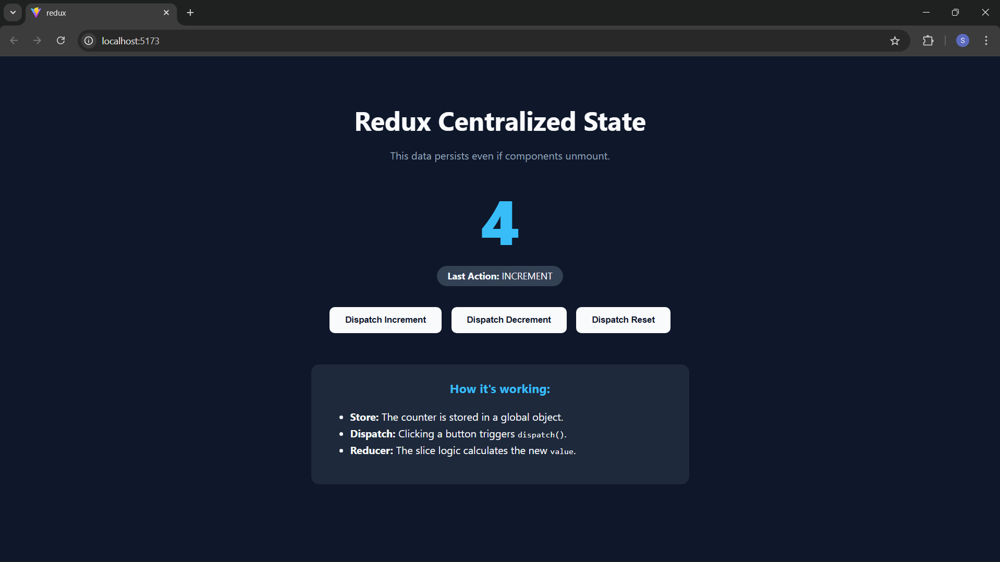

## README: Experiment-2 | Centralized State Management Using Redux

### **Aim**

To implement centralized state management using **Redux Toolkit** in a **React** application built with **Vite**.

---

### **Theory**

**Redux** is a predictable state container for JavaScript applications. It stores the application state in a single **global store** and updates it using **actions** and **reducers**. **Redux Toolkit (RTK)** is the modern standard that simplifies Redux implementation by reducing boilerplate code and providing a streamlined workflow.

#### **Core Mechanisms**

* **Store**: The "Single Source of Truth" that holds the global state.
* **Actions**: Plain objects that describe an event (what happened).
* **Reducers**: Functions that determine how the state changes based on the action received.
* **Dispatch**: The trigger used to send an action to the store.

---

### **Software Requirements**

* **Node.js**: Runtime environment.
* **React**: UI Library.
* **Vite**: Build tool for the development environment.
* **Redux Toolkit**: Efficient Redux development.
* **React-Redux**: Official React bindings for Redux.

### **Implementation Steps**
#### **1. Project Setup**
Initialize the project using Vite and install dependencies:
npm create vite@latest my-redux-app -- --template react
cd my-redux-app
npm install @reduxjs/toolkit react-redux
#### **2. Define the Slice (`src/features/counterSlice.js`)**
The slice encapsulates the logic for the state and the reducers.
#### **3. Configure the Store (`src/app/store.js`)**
The store acts as the centralized "brain" that brings all slices together.
#### **4. Provide the Store (`src/main.jsx`)**
The `Provider` component wraps the React application to make the Redux store available to all components.
#### **5. UI Interaction (`src/App.jsx`)**
Components use `useSelector` to read state and `useDispatch` to trigger updates via actions.

### **System Architecture**
The application follows a **Unidirectional Data Flow**:
1. **View**: The user clicks a button in the React UI.
2. **Dispatch**: The `useDispatch` hook sends an action.
3. **Reducer**: The `counterSlice` logic updates the state in the store.
4. **View Update**: The `useSelector` hook detects the change and re-renders the component with the new value.

### **Conclusion**
This experiment demonstrates how Redux provides a robust conceptual framework for managing state independently of the component lifecycle. By centralizing state, the application becomes easier to debug, more predictable, and capable of maintaining a consistent data flow across complex component trees.

# Screenshots
  