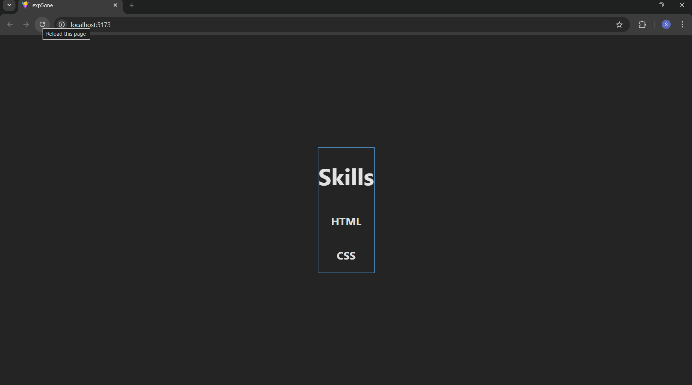
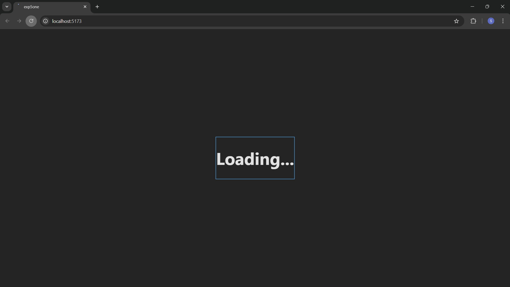

React Performance Optimization: Code Splitting with Suspense
This repository demonstrates a foundational implementation of Code Splitting in a React application using React.lazy and the Suspense component.

## Overview
In standard React bundling, the entire application is compiled into a single JavaScript file. As an app grows, this "main bundle" becomes heavy, leading to slow initial load times.

This experiment explores Dynamic Importing, a technique where specific components (like a heavy Dashboard) are separated into distinct logical chunks. These chunks are only fetched when the component is actually needed.

Key Concepts
React.lazy(): A function that lets you render a dynamic import as a regular component. It automatically handles the loading of the separate bundle.

Suspense: A wrapper component that allows you to specify a "fallback" UI (like a loading spinner or text) to display while the lazy component is being fetched over the network.

## Implementation Details
The core logic resides in App.js, where the Dashboard component is decoupled from the main entry point:

JavaScript
import './App.css';
import { lazy, Suspense } from 'react';

// The component is imported dynamically, creating a separate chunk
const Dash = lazy(() => import('./Components/Dashboard'));

function App() {
  return (
    

      {/* Suspense catches the 'promise' of the lazy component */}
      <Suspense fallback={
<h1>Loading...</h1>
}> 
        <Dash /> 
      </Suspense>
    

  );
}
export default App;

## Benefits of this Approach
Reduced Bundle Size: The initial payload sent to the browser is smaller because Dashboard is excluded from main.js.

Improved Time-to-Interactive (TTI): The browser parses less JavaScript on the first load, allowing the user to interact with the page faster.

Graceful Degradation: By using the fallback prop, we provide immediate visual feedback to the user during network latency.

## How to Run Locally
Clone the repository:
git clone <your-repo-link>
Install dependencies:
npm install
Start the development server:
npm run dev

# Screenshots

