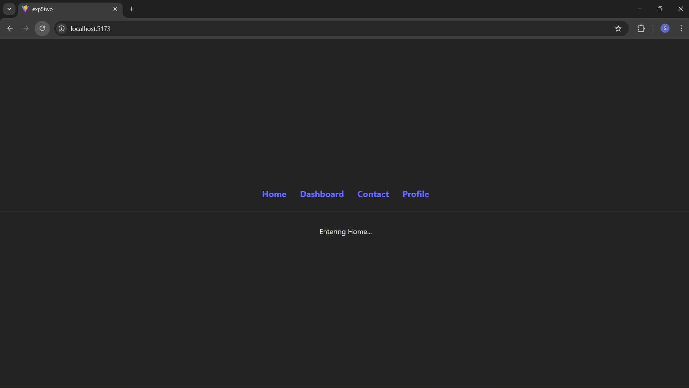
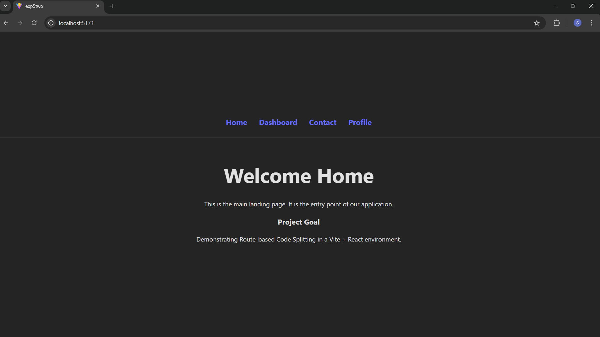
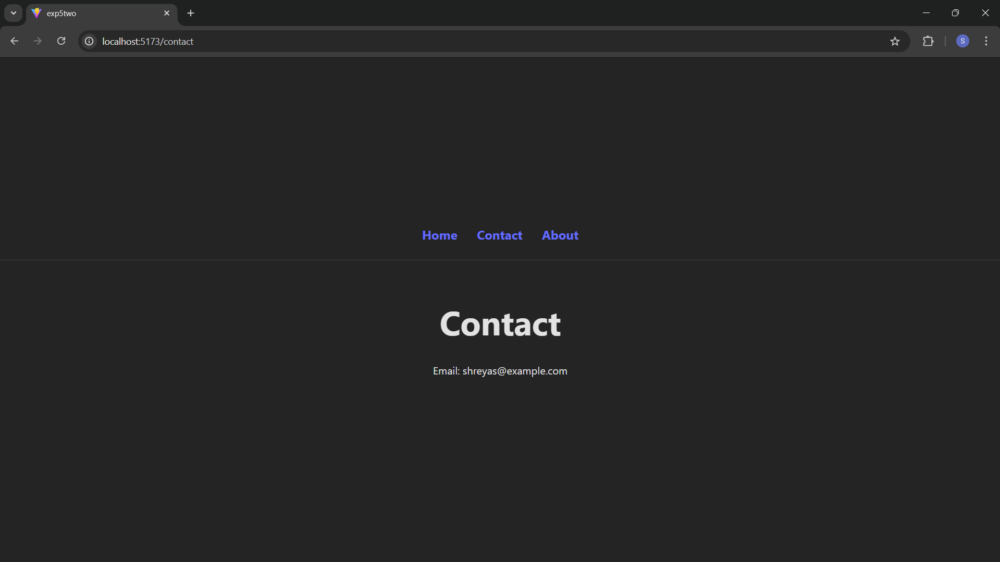
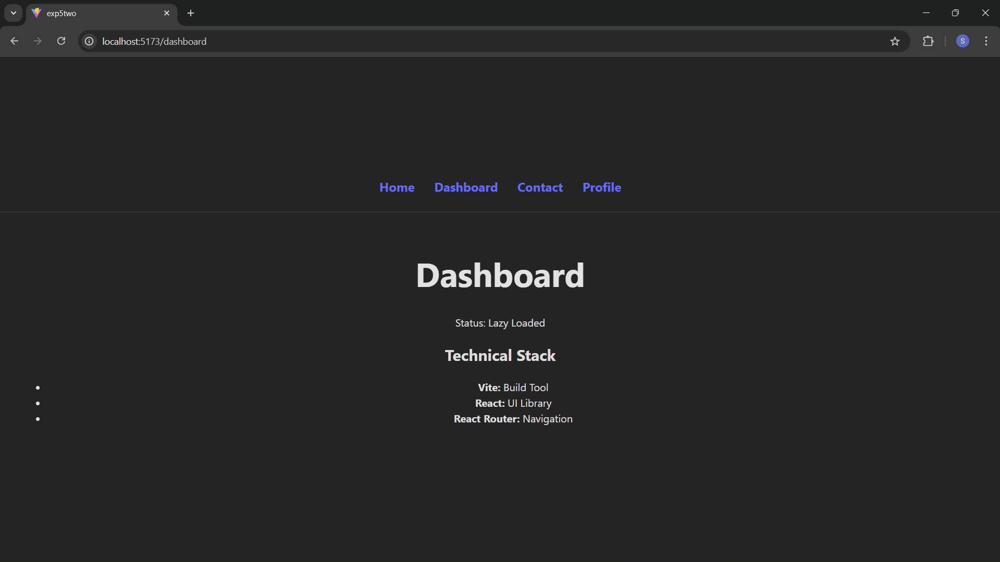
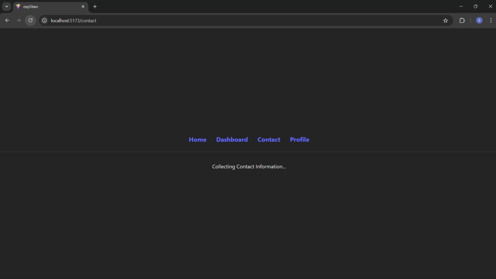
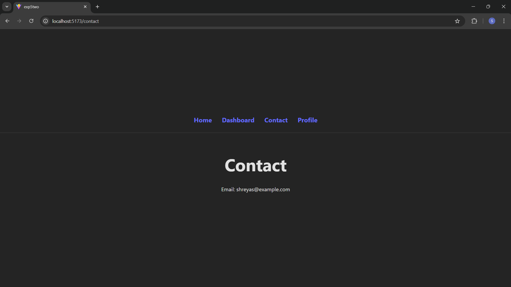
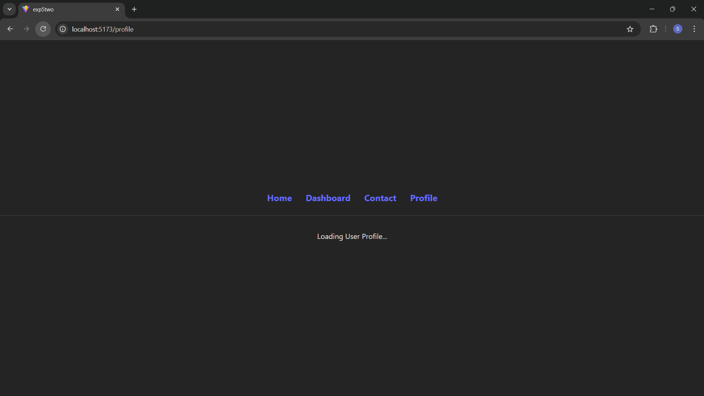

## Overview
In standard Single Page Applications (SPAs), the entire JavaScript bundle is loaded upfront. This experiment demonstrates Code Splitting, where the application is partitioned into smaller chunks. By utilizing React.lazy and Suspense, we ensure that only the code required for the current view is downloaded, significantly improving the "Time to Interactive" (TTI) and overall user experience.

## Theory
The experiment revolves around three core architectural pillars:
Dynamic Importing: Using the import() syntax to tell the bundler (Vite/Rollup) to create a separate file (chunk) for a specific component.
Lazy Loading: The React.lazy() function allows these dynamically imported components to be rendered like regular components.
Contextual Suspense: By wrapping each route in its own <Suspense> boundary, we provide Granular Loading States. This allows the UI to stay responsive and provide page-specific feedback while the browser fetches the required chunk.

## Tech Stack
Vite: Next-generation frontend tooling for fast builds and HMR.
React 18: Utilizing lazy and Suspense for concurrent rendering.
React Router DOM: For declarative, client-side navigation.
CSS3: Custom layout styles to prevent "Layout Shift" during loading.

## Structure
The project is organized to separate navigation logic from page content:
src/
├── App.jsx            # Routing hub with individual Suspense boundaries
├── App.css            # Global layout and horizontal Navbar styling
├── Components/        # All components are exported as default for lazy loading
│   ├── Navbar.jsx     # Persistent navigation using <Link>
│   ├── Home.jsx       # Static landing page
│   ├── Dashboard.jsx  # Skillset component (Lazy)
│   ├── Contact.jsx    # Contact interface (Lazy)
│   └── Profile.jsx    # User profile component (Lazy)
└── main.jsx           # Entry point
## Running the Project
1. Prerequisite Libraries
Before running, you must install the routing library, as it is not included in the default Vite template:
npm install react-router-dom
2. Installation
Install all project dependencies:
npm install
3. Execution
Launch the local development server:
npm run dev
4. Testing the Experiment
To see the Contextual Loading Screens:
Open your browser's DevTools (F12).
Navigate to the Network tab and set Throttling to Slow 4G.
Click through the Navbar links. You will notice that each page shows its own unique "Loading..." message (e.g., "Fetching your stats..." for Dashboard vs. "Loading User Profile..." for Profile).

## Conclusion
This experiment successfully demonstrates that wrapping individual routes in separate Suspense boundaries provides a more polished, professional feel compared to a single global loading spinner. It ensures the user receives contextual feedback relevant to the page they are attempting to access.
# Screenshots
         