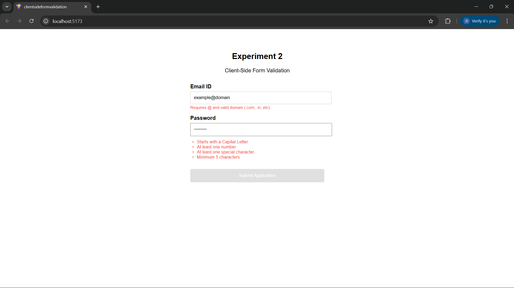
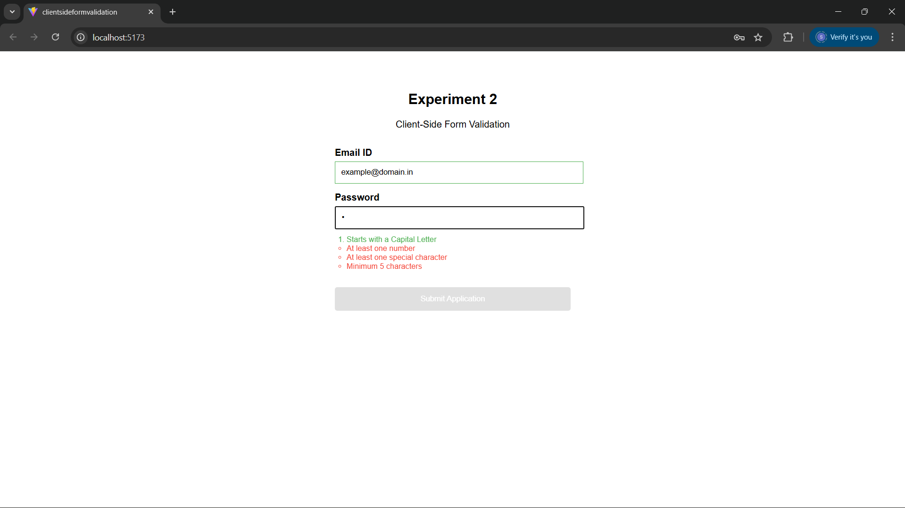
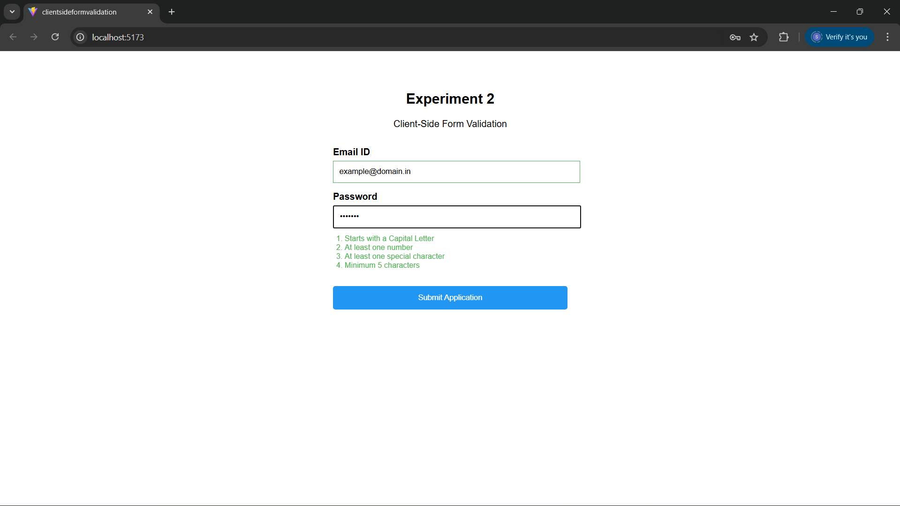
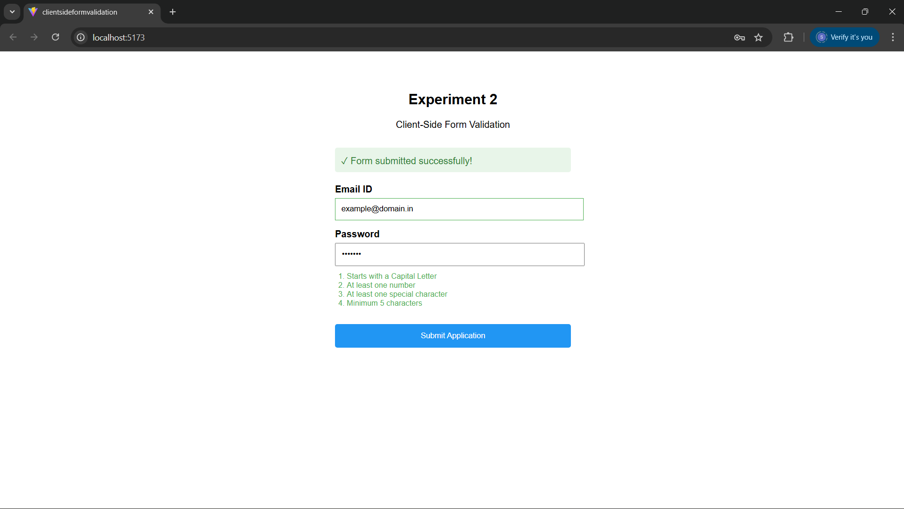

Experiment: Client-Side Form Validation
1. Objective
To implement a robust, client-side validation system that enforces data integrity for email and password inputs before submission. The experiment emphasizes derived state and real-time UI feedback.

2. Technical Theory
Client-side validation improves user experience by catching errors immediately, reducing unnecessary server requests. In this implementation:

RegEx (Regular Expressions): Used to perform pattern matching for email syntax and password complexity.

Derived State: Validation logic is calculated during every render cycle based on the current formData, ensuring the UI is always in sync with the input.

Conditional Rendering: UI elements (error messages, requirement checklists, and success alerts) appear or disappear based on boolean validation flags.

3. Implementation Features
A. Email Validation
The email input is validated against a standard lexical pattern:

Pattern: /^[^\s@]+@[^\s@]+\.(com|in|[a-zA-Z]{2,})$/

Criteria: Must contain an @ symbol, a domain name, and a valid TLD (Top-Level Domain) like .com or .in.

B. Password Complexity Matrix
Instead of a single error message, the system uses a Requirement Checklist to provide granular feedback.
| Requirement | Validation Mechanism (RegEx) |
| :--- | :--- |
| Capital Start | ^[A-Z] — Checks if the first character is an uppercase letter. |
| Numeric Inclusion | \d — Scans the string for at least one digit. |
| Special Character | [!@#$%^&*(),.?":{}|<>] — Checks for non-alphanumeric symbols. |
| Length Constraint | .length >= 5 — Ensures the string meets the minimum length. |

C. Submission Guard (Non-Functional Requirement)
To ensure Robustness, the "Submit Application" button is logically bound to the canSubmit constant.

State: disabled={!canSubmit}.

Visual Cue: The cursor changes to not-allowed and the button color desaturates when the form is invalid.

4. Component Structure
The application is organized into three primary sections:

State Layer: Uses useState to track input values and the submission status.

Logic Layer: Evaluates RegEx patterns on every keystroke to determine the validity of the form.

Presentation Layer:
    Controlled Inputs: Fields are bound to React state.
    Requirement Component: A reusable sub-component that visually toggles between "Met" (Green/Check) and "Unmet" (Red/Circle) states.

## Screenshots
   