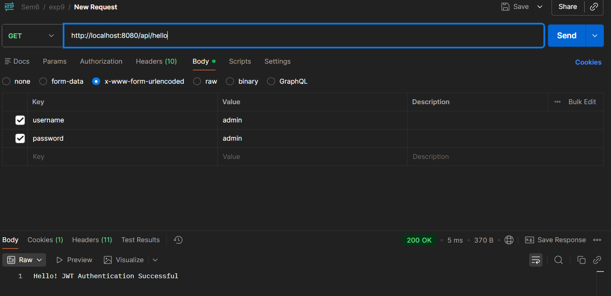
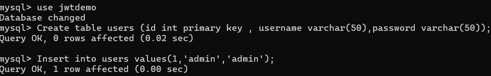
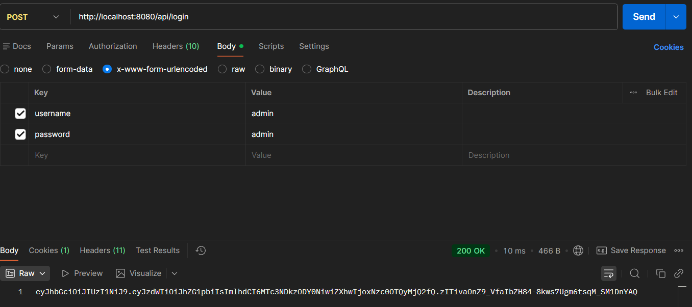
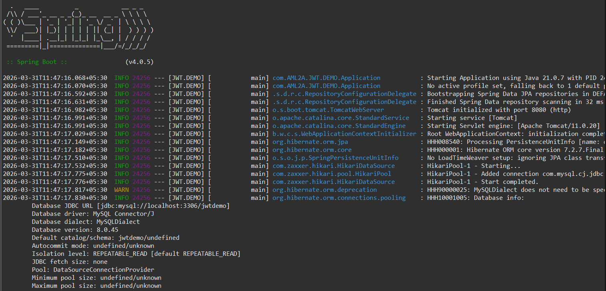

1. Conceptual Theory: The Stateless Paradigm
The core logic of this experiment is built upon the transition from Stateful (Session-based) to Stateless (Token-based) security.

The Invariant Principle: Cryptographic Trust
In a traditional system, the server stores a "session" in memory and gives the user a SessionID. In this JWT experiment, the server does not "remember" the user. Instead, it issues a digitally signed claim.

The Logic: If the server receives a token and the cryptographic signature is valid (verified via a secret key), the server deduces that the information within the token is authentic without needing to check a database or local cache for an active session.

The System Components
AuthController: The API Gateway. It defines the contract between the client and the authentication logic.

JwtUtil: The Cryptographic Engine. It handles the creation, signing, and parsing of the JWT.

SecurityConfig: The Filter Chain. It dictates which paths are "Public" (e.g., /api/login) and which are "Protected" (e.g., /api/hello).

AuthService: The Validation Logic. It bridges the controller and the repository to verify user existence.

2. Experimental Workflow: The Logic of Access
To understand how your AuthController functions in the broader system, we must trace two distinct logic flows.

Flow A: The Issuance (The /login Endpoint)
This is where the "Identity" is exchanged for a "Credential."
Request: The client sends a POST request to /api/login with username and password.
Verification: The AuthService.login() method checks the UserRepository to see if the credentials match.
Token Generation: Upon successful verification, the system uses JwtUtil to create a string (the JWT).
Structure: It encodes the username (Subject), issue time, and expiration.
Signing: It signs the string using a secret key (HMAC-SHA256).
Response: The JWT is returned to the client. The server now "forgets" this interaction.

Flow B: The Verification (The /hello Endpoint)
This is where the "Credential" is used to prove "Identity."
Request: The client attempts to access the protected GET /api/hello endpoint. They must include the token in the HTTP Header: Authorization: Bearer <token>.
Interception: Before the request hits the hello() method (line 25), a JWT Filter (defined in your security package) intercepts it.
Following checks are made:
Does the token exist?
Is the signature valid against our secret key?
Is the exp (expiration) claim still in the future?
Context Injection: If valid, the filter tells Spring Security, "This request is authenticated as User X."
Execution: Only now does line 26 execute, returning the success message.

## Screenshots
GET MYSQL POST SPRING