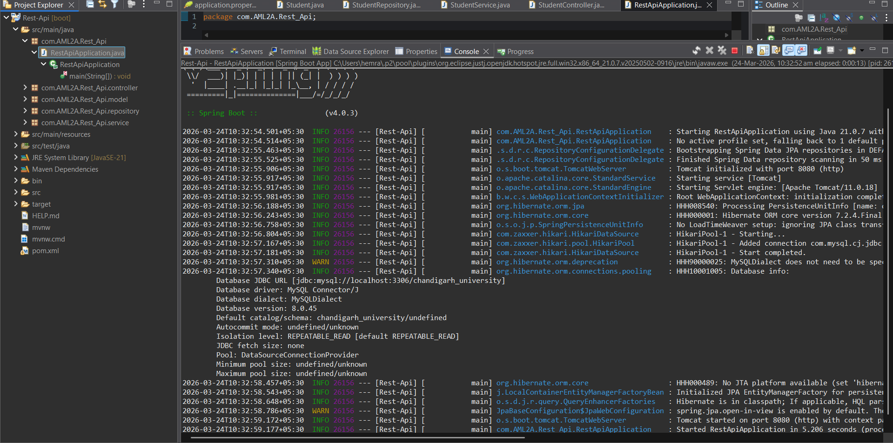
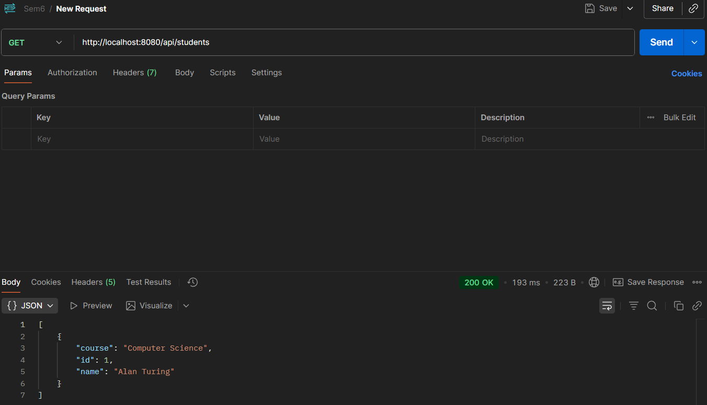
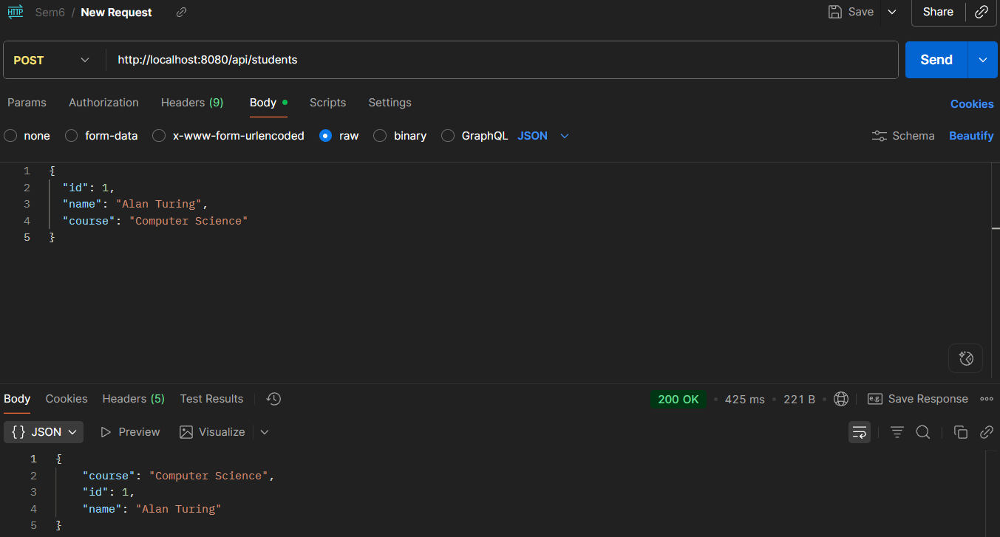
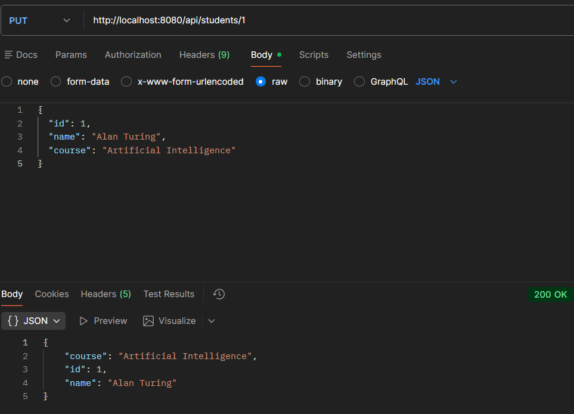
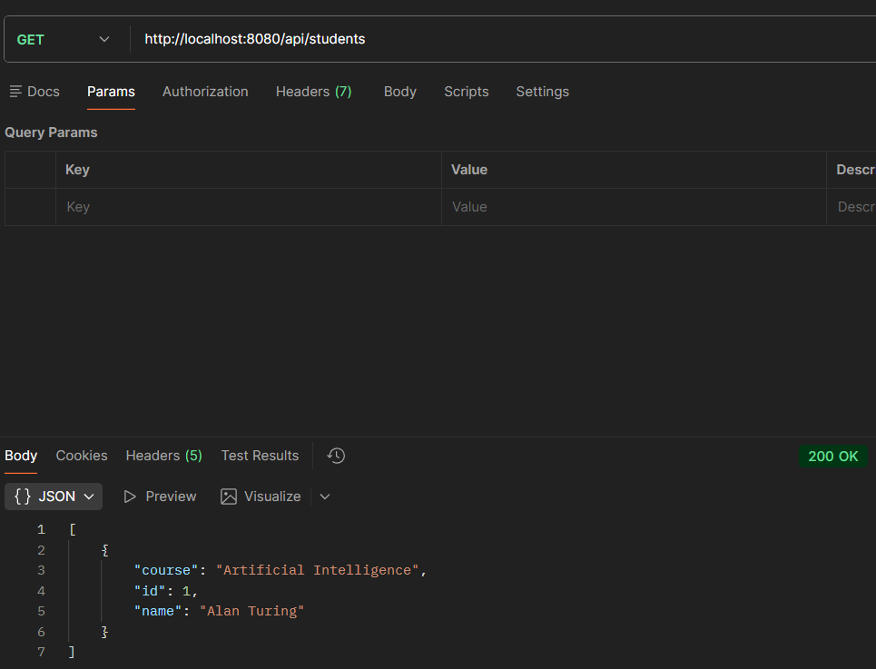
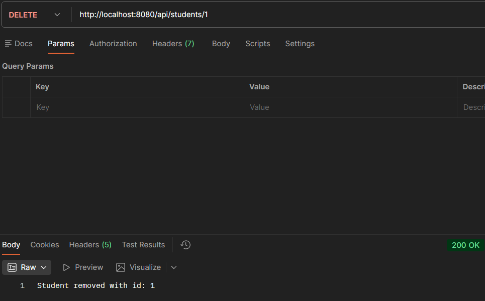

# Spring Boot Student Management REST API

## Systemic Overview
This project is a foundational RESTful Application Programming Interface (API) engineered to demonstrate the invariant principles of the Client-Server model, Object-Relational Mapping (ORM), and standard CRUD (Create, Read, Update, Delete) operations. 

Operating as an autonomous backend server, it intercepts HTTP requests, evaluates business logic, and executes state mutations against a persistent relational database.

### Architectural Framework
The system strictly adheres to a highly decoupled, layered architecture:
* **Model (`Student.java`):** The invariant data schema defining the precise anatomical structure of the informational entity (ID, Name, Course).
* **Repository (`StudentRepository.java`):** The data access layer utilizing Spring Data JPA to automatically translate Java method invocations into underlying SQL dialect, acting as the bridge to MySQL.
* **Service (`StudentService.java`):** The logic layer responsible for evaluating and processing data objects before authorizing database transactions.
* **Controller (`StudentController.java`):** The network boundary. It defines the routing matrix, mapping specific URI endpoints and HTTP verbs to internal Java methods.

---

## Prerequisites
To achieve the necessary operational state, the host machine must possess the following independent systems:
1. **Java Development Kit (JDK):** Version 21 (or compatible).
2. **Integrated Development Environment (IDE):** Eclipse IDE (or equivalent like IntelliJ IDEA).
3. **Database Server:** MySQL Server running as a background daemon on port `3306`.
4. **API Client:** Postman (for dispatching simulated network requests).

---

## Initiation Protocols

### Phase 1: Persistence Layer Setup (MySQL)
The Spring Boot application requires a pre-existing logical container to map its tables. 
1. Open your MySQL Command Line Client or MySQL Workbench.
2. Authenticate using the `root` user and your configured password.
3. Execute the following SQL command to establish the database schema:
   ```sql
   CREATE DATABASE chandigarh_university;

## Application Configuration
Ensure the environmental variables in src/main/resources/application.properties correctly point to your local database instance:
# Web Server Configuration
server.port=8080

# MySQL Connection Coordinates
spring.datasource.url=jdbc:mysql://localhost:3306/chandigarh_university
spring.datasource.username=root
spring.datasource.password=963270
spring.datasource.driver-class-name=com.mysql.cj.jdbc.Driver

# Hibernate ORM Configuration
spring.jpa.hibernate.ddl-auto=update
spring.jpa.show-sql=true
spring.jpa.database-platform=org.hibernate.dialect.MySQLDialect

## Phase 3: Server Execution
Open the project in Eclipse IDE.
Navigate to the root execution file: src/main/java/com/AML2A/Rest_Api/RestApiApplication.java.
Right-click the file -> Run As -> Java Application (or Spring Boot App).
Observe the Eclipse Console. The server is successfully online when the terminal logs: Tomcat started on port(s): 8080 (http).
API Routing Matrix & Documentation
Once the server is actively listening on port 8080, you may utilize Postman to execute the following network requests.

1. Create a Student (POST)
Writes a new entity to the database.
URL: http://localhost:8080/api/students
Method: POST
Data Type: Raw -> JSON
Payload:
JSON
{
  "id": 1,
  "name": "Alan Turing",
  "course": "Computer Science"
}

2. Retrieve All Students (GET)
Fetches an array of all current entities.
URL: http://localhost:8080/api/students
Method: GET
Payload: None required.

3. Retrieve a Specific Student (GET)
Fetches a single entity based on its primary key.
URL: http://localhost:8080/api/students/{id} (e.g., /api/students/1)
Method: GET
Payload: None required.

4. Update a Student (PUT)
Mutates the state of an existing entity.
URL: http://localhost:8080/api/students/{id} (e.g., /api/students/1)
Method: PUT
Data Type: Raw -> JSON
Payload:
JSON
{
  "id": 1,
  "name": "Alan Turing",
  "course": "Artificial Intelligence"
}

5. Delete a Student (DELETE)
Removes an entity from the database permanently.
URL: http://localhost:8080/api/students/{id} (e.g., /api/students/1)
Method: DELETE
Payload: None required.

## Screenshots

Initialize springboot application 
Get Request  
Post Request  
Put Request  
Verify Put Request  
Delete Request 